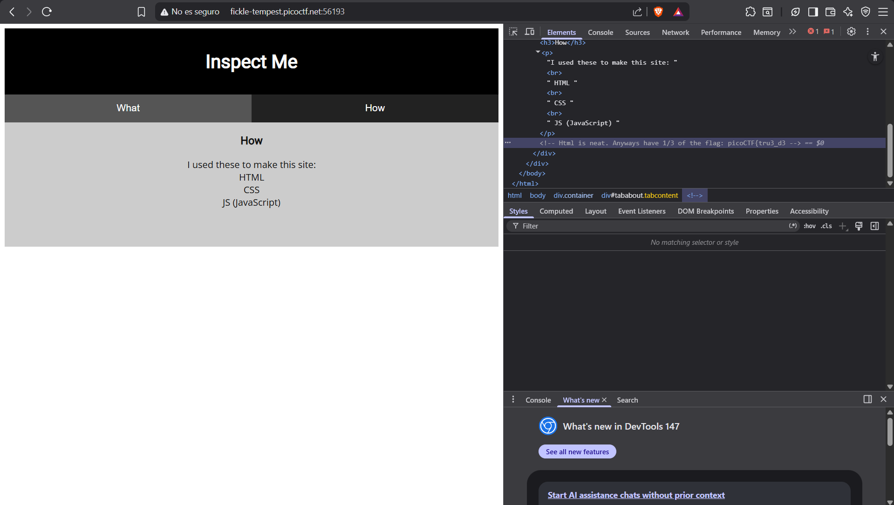
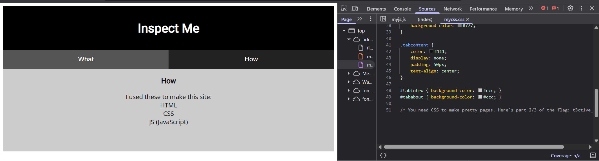
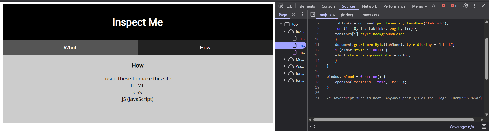

nos da un link que es la siguinte:
http://fickle-tempest.picoctf.net:56193

y nos manda a un apagina web la cual inspecionamos:
## Codigo Html


y nos da comentado

```text
<!-- Html is neat. Anyways have 1/3 of the flag: picoCTF{tru3_d3 -->
```
## codigo css


```text
/* You need CSS to make pretty pages. Here's part 2/3 of the flag: t3ct1ve_0r_ju5t */
```

## Codigo js

```text
/* Javascript sure is neat. Anyways part 3/3 of the flag: _lucky?302945a7} */
```
### Flags encontradas
1 = picoCTF{tru3_d3
2 = t3ct1ve_0r_ju5t
3 = _lucky?302945a7}

la flag es **picoCTF{tru3_d3t3ct1ve_0r_ju5t_lucky?302945a7}**